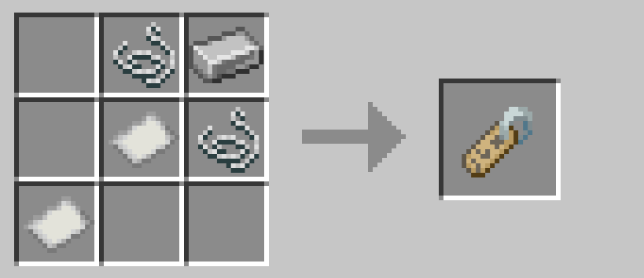
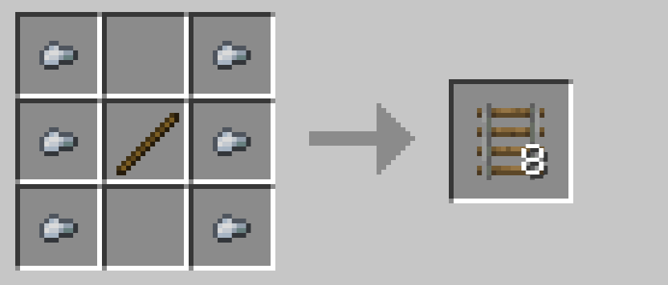
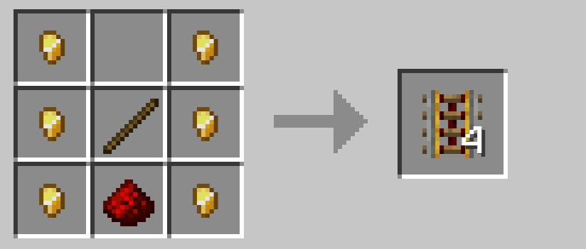
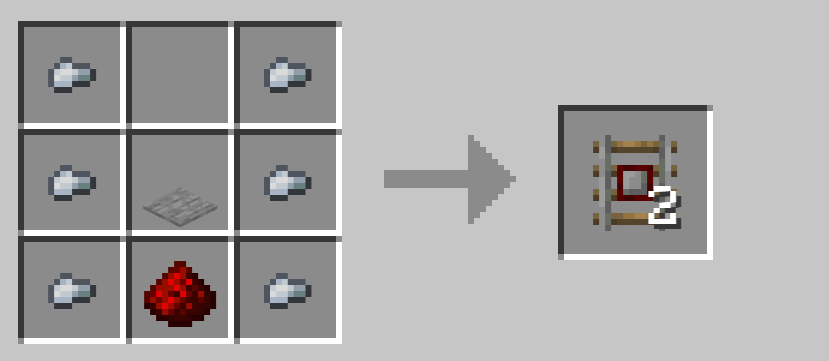
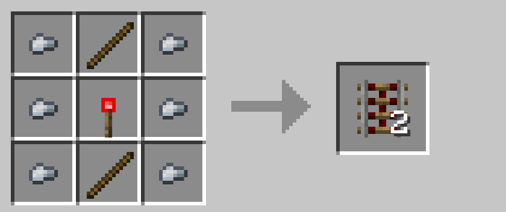
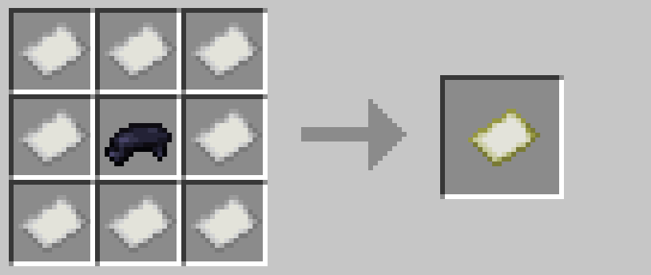

**A collection of small Fabric mods for the Rainbow Kitty Club server.**

# Recipe Tweaks

### Name Tag Recipe
- Part of the `rainbowkittytweaks:craftable_name_tag` datapack. Enabled by default.

### Cheaper Rails
- Part of the `rainbowkittytweaks:cheaper_rails` datapack. Enabled by default.

### Cheaper maps
- Part of the `rainbowkittytweaks:cheaper_maps` datapack. Enabled by default.

# Gameplay Tweaks

### Leg armor negates sweet berry thorn damage
- Configurable with the new `gamerule legArmorProtectsFromBerryThorns`, default `true`.

### All recipes are granted when joining server
- Configurable with the new `gamerule giveAllRecipes`, default `true`.

### Command blocks can be disabled
- Using the new `gamerule commandBlocksEnabled`, default `true`.
- Command blocks still need to be enabled in `server.properties`.

### Flaming arrows ignite fire if they land on a flammable surface
- Configurable using the new `gamerule fireArrowsLightFire`, default `true`.

### Iron golems regenerate over time
- Configurable using the new `gamerule ironGolemRegenTicks`, default `60`.
- Value is number of ticks between each regeneration event, where the golem gains 1hp.
- `gamerule ironGolemRegenDelay` specifies the number of ticks to wait after the golem takes damage to resume healing.

# Misc

### Farmer's Delight rope categorization
- Puts the rope in the right category so that it can be used in recipes that use `#c:ropes` as an ingredient.
- Part of the `rainbowkittytweaks:farmersdelight_rope_compat` datapack. Disabled by default.